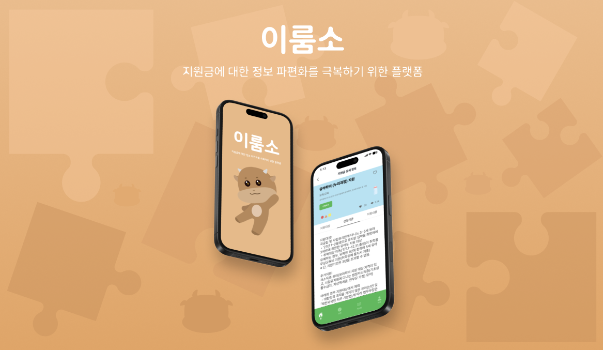

# IRUMSO

2030 청년들을 위한 다양한 지원금들 존재하고 있음에도 불구하고
정리되어 있지 않은채 쏟아지는 정보들, 즉 정보의 파편화로 인해
청년들이 지원금을 받을 수 있는 기회를 놓치고 있는 것을 문제라고 인식

따라서 파편화된 정보들을 한데 모아 성별, 나이, 소득 등 기본적인 정보만 입력해도
받을 수 있는 지원금 목록을 보여주는 서비스, `이룸소(IRUMSO)`를 기획

➡️ 지원금 혜택을 통해 청년들의 경제적 자립과 사회적 기회를 확대하는 데 기여

- 간단한 설문조사를 통해 사용자가 받을 수 있는 지원금 목록 맞춤 제공
- 이외에도 다른 사용자들이 많이 본/관심을 가진 지원금 등 통합된 지원금 정보 제공
- 게시판을 이용해 지원금 신청 과정, 후기 등 다양한 의견을 공유하는 커뮤니티 제공

