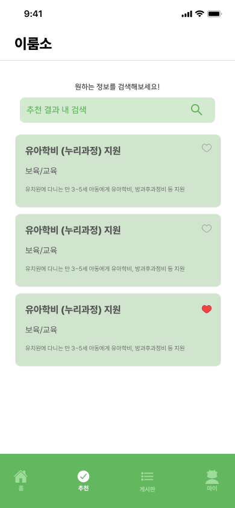

# IRUMSO

2030 청년들을 위한 다양한 지원금들 존재하고 있음에도 불구하고
정리되어 있지 않은채 쏟아지는 정보들, 즉 정보의 파편화로 인해
청년들이 지원금을 받을 수 있는 기회를 놓치고 있는 것을 문제라고 인식

따라서 파편화된 정보들을 한데 모아 성별, 나이, 소득 등 기본적인 정보만 입력해도
받을 수 있는 지원금 목록을 보여주는 서비스, `이룸소(IRUMSO)`를 기획

---

➡️ 지원금 혜택을 통해 청년들의 경제적 자립과 사회적 기회를 확대하는 데 기여

- **조회수/관심 순위별 지원금 조회 기능**
    - 좋아요/조회 수 순으로 홈 화면에 지원금 노출
- **설문조사 및 맞춤형 지원금 추천 기능**
    - 성별, 나이, 직업, 소득 등에 적합한 맞춤형 지원금 추천
- **지원금 정보 나눔 커뮤니티 기능**
    - 지원금과 관련한 정보를 공유하거나 질문하며 소통할 수 있는 소통 창구 제공

---
### 📱

  
접속화면

  
홈 화면

  
추천 화면

  
게시판 화면

  
마이페이지

---
🛠️

- FE
  - 언어: Swift
  - 프레임워크: UIKit
  - 3rd Party Library: Alamofire, Then, SnapKit
  - 카카오 SDK
- BE
  - 언어: Java 17
  - 프레임워크: Spring Boot 3
  - Database: MySQL
  - Cloud: GCP , Jenkins(CI/CD)
  - 카카오 OAuth 2.0
- OPEN API
  - 카카오 API - 소셜 로그인
  - 공공데이터포털 Open API - 행정안전부_대한민국 공공서비스 정보 (보조금24)
  - 한국고용정보원 온통청년 (Open) API - 대한민국 청년정책, 청년공간 정보 제공 (Open) API

---
[FrontEnd repo](https://github.com/9oormthon-univ/2024_DANPOONG_TEAM_53_FE)

[BackEnd repo](https://github.com/9oormthon-univ/2024_DANPOONG_TEAM_53_BE)